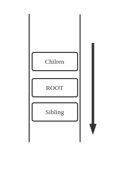
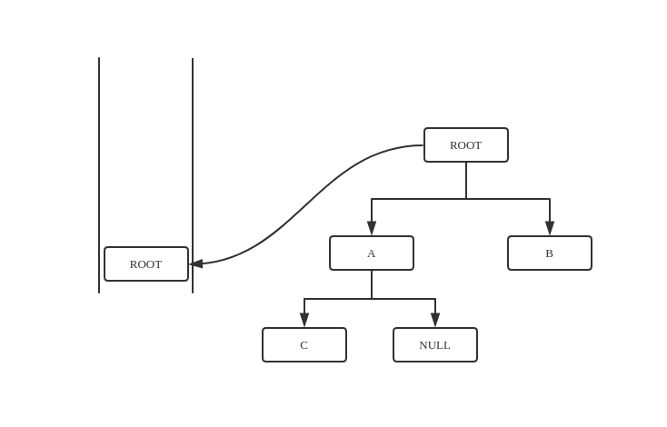
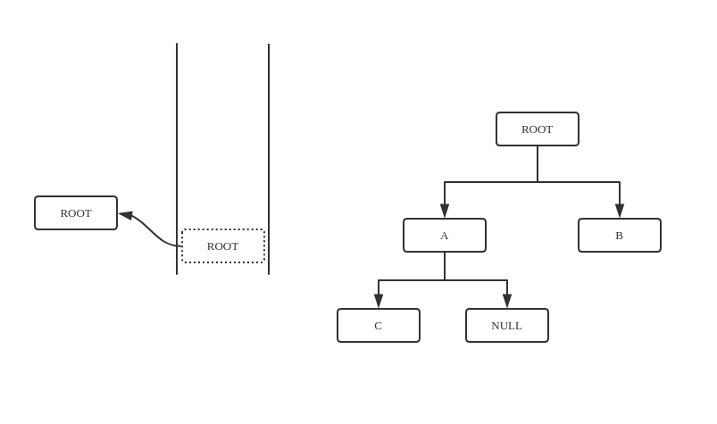
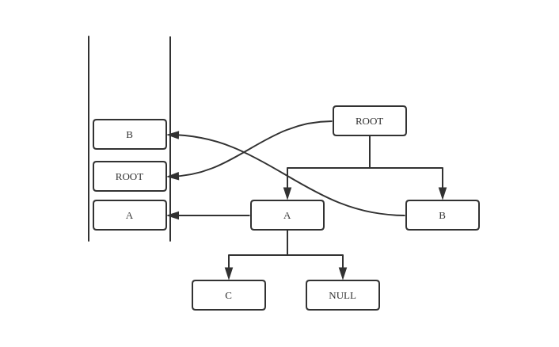
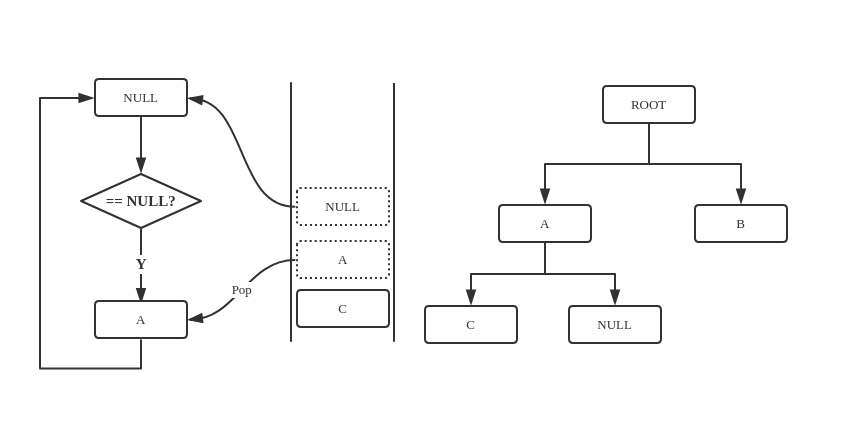

# 前话

写孩子-兄弟法表示森林，遇到了用非递归实现中序遍历。先没有参考教材上给的伪 C 算法，而是自己独立实现了另一种算法，相比教材的算法，代码量多了一些，操作略微复杂了一点。不管怎么说还是自己独立做出来的。

实质上，森林的后根遍历就是二叉树的中序遍历。

# 来，上代码

```c
void Tree::_postorderStackTraverse(Node* &TNode, void (* visit)( ElemType e) ) {
    stack<Node *> Traverse;
    Traverse.push( TNode );
    while ( true ) {
        // 入栈操作
        Node *topOne = Traverse.top();
        Traverse.pop();
        if (!topOne) {
            if ( Traverse.empty() ) {
                break;
            }
            topOne = Traverse.top();
            Traverse.pop();
            visit(topOne->data);
            continue;
        }
        Traverse.push(topOne->nextSibling);
        Traverse.push(topOne);
        Traverse.push(topOne->childNode);
    }
}
```

# 解释

基本思路就是利用栈，森林后根遍历的特点：**孩子应该被先访问，根再被访问，兄弟最后被访问**。



只要将树的节点按照上面的思路放入栈即可。初始时，栈中有一个根元素（先假设有孩子节点和兄弟节点），将根节点取出，依次放入兄弟节点（在栈底最后被访问），根节点，孩子节点（在栈顶最先被访问）。放好以后进入下一个循环，原来的孩子节点成了根节点，重复之前的步骤。







这样已经做到了把二叉树放入栈中，还有一种很重要的问题就是：根节点没有兄弟和孩子节点的情况，这就时候应该退栈了。

回到之前的放入的步骤，假设根节点的兄弟节点，孩子节点都是`NULL`，我们依旧全部放入栈中，但是，这里就需要在取出栈顶元素的同时，判断取出的元素是否为空，非空就说明当前分支没有走到尽头，就放入其兄弟节点，自己本身，其孩子节点，为空就说明走到了尽头，没有元素可以放入栈中，再次执行出栈操作取出栈中的下一个节点（当前的`NULL`节点的父亲节点），并且访问取出的节点，再依次放入取出的节点的兄弟节点，本身，孩子节点，结束一次循环。



如此，便可以做到二叉树的中序遍历。需要注意的一点是：遇到`NULL`节点，再取下栈中一个节点时，要判断一下是否栈为空，为空就结束循环。

<!-- # 结语

拖了好久，终于补上了这个坑。 -->
